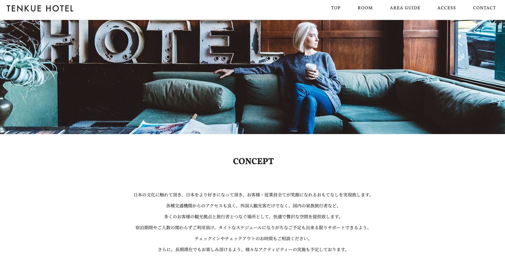
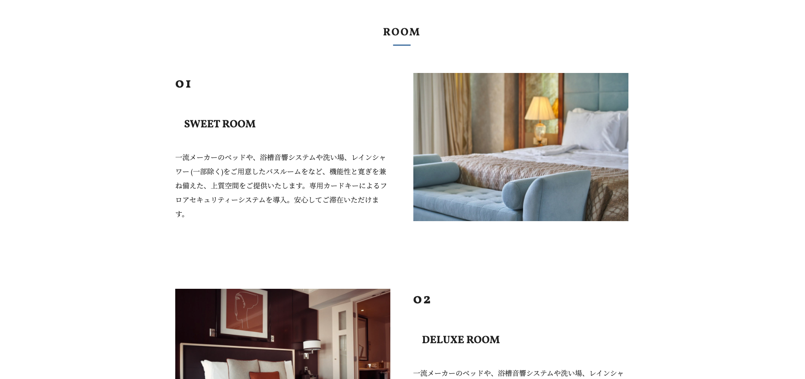
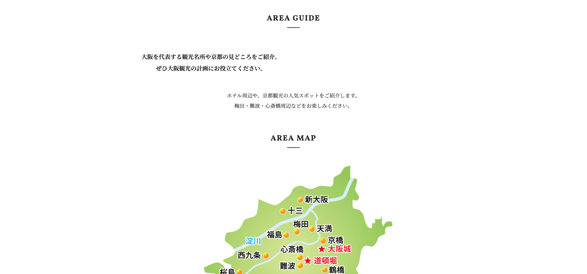
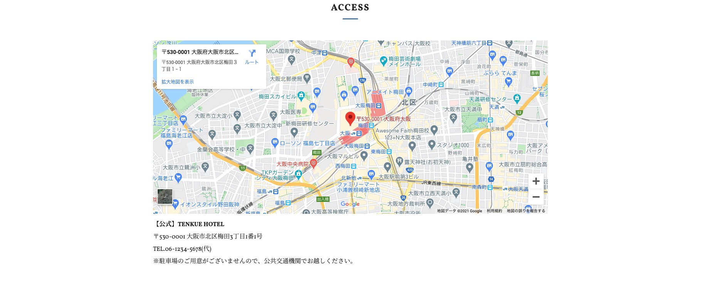
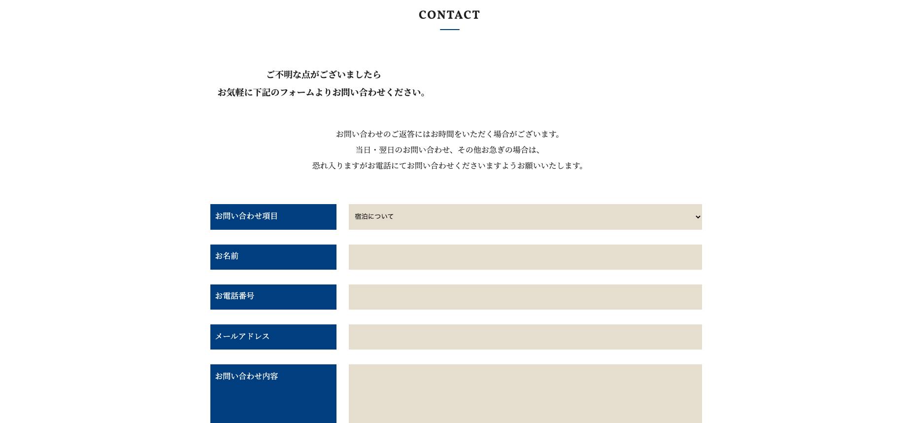
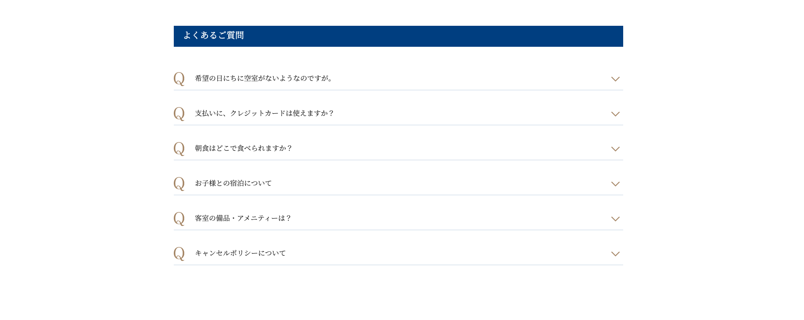

# README（Joint development guidelines）

## DEMO
- Top page

- Room page

- Ariaguide page

- Access page

- Contact page

- Faq page

## Purpose
Experience the development flow in joint development, how to communicate, and how to use the tools

## Deliverables
TENKUE HOTEL 
Sample→ [TENKUE HOTEL](https://tenkue-hotel.takanori-portfolio.com/)

## Requirements
- EJS
- Sass
- JavaScript or jQuery
- Node.js 12.14.1
- Notation：Scss
- CSSdesign：FLOCSS（https://github.com/hiloki/flocss)
- GitHub

## Deployment
 To view it in the Local browser

 1. `git clone (https://github.com/daikishirakawa/tenkue-app.git)`

 1. `cd tenkue_hotel_lp`
 
 1. `npm run start`

## Author
Mentor[Taka](https://twitter.com/takaIT3)
Author[shiro](https://twitter.com/next_shiro)
Author[kuma](https://twitter.com/ingenieur_noel)
Author[sho](https://twitter.com/ryuprogramSA)
Author[masahiro](https://twitter.com/prograrning)

